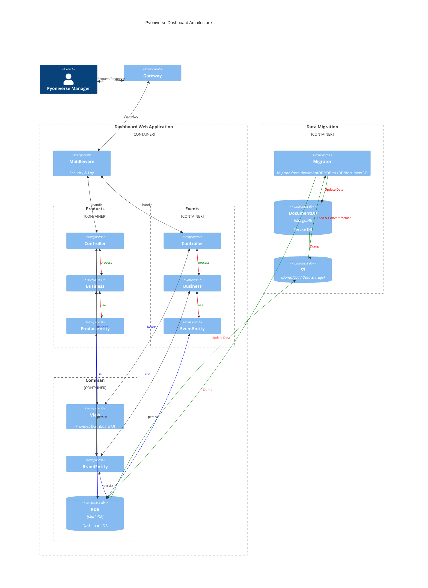

# Dashboard
## Architecture
| SOA + Domain 기반 + MVC & Humble Pattern

```mermaid
---
title: Pyoniverse Dashboard Architecture
---
C4Component
    title Pyoniverse Dashboard Architecture
    Person(admin, "Pyoniverse Manager")
    Component(gateway, "Gateway", "")
    BiRel(admin, gateway, "Request/Response")
    UpdateRelStyle(admin, gateway, $offsetX="-50", $offsetY="-10")

    Container_Boundary(web_boundary, "Dashboard Web Application") {
        Component(middleware, "Middleware", "", "Security & Log")
        BiRel(gateway, middleware, "Verify/Log")

        Container_Boundary(product_domain, "Products") {
            Component(product_controller, "Controller")
            Component(product_business, "Business")
            Component(product_entity, "ProductEntity")

            BiRel(middleware, product_controller, "handle")
            BiRel(product_controller, product_business, "process")
            BiRel(product_controller, view, "Render")
            BiRel(product_business, product_entity, "use")
            BiRel(product_business, brand_entity, "use")
            UpdateRelStyle(product_controller, view, $textColor="blue")
            UpdateRelStyle(product_controller, product_business, $textColor="green", $lineColor="red")
            UpdateRelStyle(product_business, product_entity, $textColor="green", $lineColor="red")
            UpdateRelStyle(product_business, brand_entity, $textColor="blue")
        }

        Container_Boundary(event_domain, "Events") {
            Component(event_controller, "Controller")
            Component(event_business, "Business")
            Component(event_entity, "EventEntity")

            BiRel(middleware, event_controller, "handle")
            BiRel(event_controller, event_business, "process")
            BiRel(event_controller, view, "Render")
            BiRel(event_business, event_entity, "use")
            BiRel(event_business, brand_entity, "use")
            UpdateRelStyle(event_controller, view, $textColor="blue")
            UpdateRelStyle(event_controller, event_business, $textColor="green", $lineColor="red")
            UpdateRelStyle(event_business, event_entity, $textColor="green", $lineColor="red")
            UpdateRelStyle(event_business, brand_entity, $textColor="blue")
        }
        Container_Boundary(common, "Comman") {
            Component(view, "View", "", "Provides Dashboard UI")
            Component(brand_entity, "BrandEntity")
            ComponentDb(rdb, "RDB", "MariaDB", "Dashboard DB")
            BiRel(brand_entity, rdb, "persist")
            BiRel(product_entity, rdb, "persist")
            BiRel(event_entity, rdb, "persist")
            UpdateRelStyle(brand_entity, rdb, $textColor="pupple", $lineColor="blue")
            UpdateRelStyle(event_entity, rdb, $textColor="pupple", $lineColor="blue")
            UpdateRelStyle(product_entity, rdb, $textColor="pupple", $lineColor="blue")
        }
    }
    Container_Boundary(migration_boundary, "Data Migration") {
        Component(migrator, "Migrator", "", "Migrate from documentDB/rDB to rDB/documentDB")
        ComponentDb(document_db, "DocumentDB", "MongoDB", "Service DB")
        ComponentDb(tmp_storage, "S3", "Dump/Load Data Storage")
        Rel(document_db, tmp_storage, "Dump")
        Rel(rdb, tmp_storage, "Dump")
        Rel(tmp_storage, migrator, "Load & Convert format")
        Rel(migrator, document_db, "Update Data")
        Rel(migrator, rdb, "Update Data")
        UpdateRelStyle(document_db, tmp_storage, $textColor="red", $lineColor="green")
        UpdateRelStyle(rdb, tmp_storage, $textColor="red", $lineColor="green")
        UpdateRelStyle(tmp_storage, migrator, $textColor="red", $lineColor="green")
        UpdateRelStyle(migrator, document_db, $textColor="red", $lineColor="green")
        UpdateRelStyle(migrator, rdb, $textColor="red", $lineColor="green")
    }
```